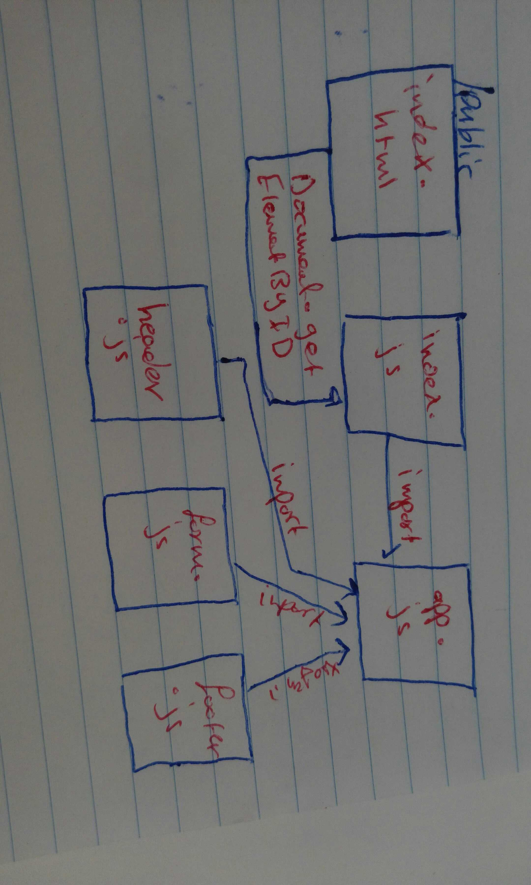

#  LAB - Class 36

## Application State with Redux

### Author: Saja Swalgah

### Links and Resources

- [submission PR](https://github.com/Saja-401-advanced-javascript/class-36/pull/1)
- [Netlify Deploy](https://angry-galileo-a0c0cf.netlify.com/)

#### How to initialize/run your application (where applicable)

-`npm run start` || `nodemon`

#### UML

